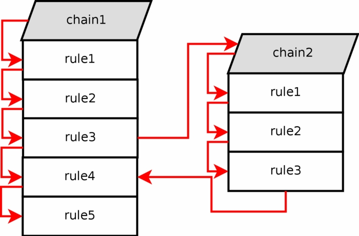

# Tìm hiểu về Chains trong iptables:

Nội dung:
- 1. Built-in chain
- 2. User-specified chain

## 1. Built-in chain:

- Bao gồm các chain như PRERROUTING, INPUT, OUTPUT, FORWARD, POSTROUTING

- Các chains này sẽ được giới thiệu ở bài packet-flow

## 2. User specified chains:

- Là chains do user tự định nghĩa. 

- Nếu một packet tới INPUT chain ở filter table, thường thì packet đó sẽ được tiếp tục được xử lý ở INPUT chain. Tuy nhiên, ta có thể chỉ định rằng packet đó hãy chuyển sang chain khác để xử lý, nhưng phải trong cùng một table bằng cách sử dụng một jump rule. 
  - Chain được nhảy tới này phải là chain được định nghĩa bởi người dùng, không được là built-in chain như OUTPUT hay FORWARD.

- Ví dụ như với Chain dưới đây: 
  - Ở rule3 của chain1, ta định nghĩa một jump rule rằng nếu packet có các thông tin như này, thì hãy chuyển sang Chain2 để xử lý (với chain2 là chain mà user tự định nghĩa ra).

  - Sang chain2, packet sẽ đi tuần tự từng rule1 cho đến khi match được target cần tìm. Nếu không tìm được target cần thiết, nó sẽ tiếp tục đi hết chain2, sau đó sẽ chuyển tiếp sang rule4 của chain1.

  - Ở đây có thể hiểu như một pointer tới một chain tự định nghĩa khác. 

> Note: Userspecified chains không có tính năng Default policy, hay nói một cách khác, ta không thể có một default policy như các built-in chain khác. 

> Tuy nhiên, ta có thể "lách luật" bằng cách định nghĩa một rule ở cuối chain mà không định nghĩa match cho chain, nghĩa là khi gói tin traverse tới cuối chain, thì rule này sẽ luôn được match

- Nếu không có rule nào match với thông tin của packet trong userspecified chain, mặc định thì gói tin đó sẽ quay trở lại chain trước đó đã gửi nó đi.