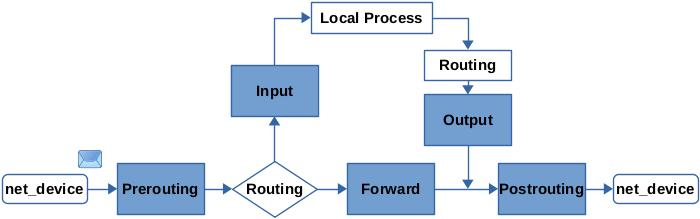
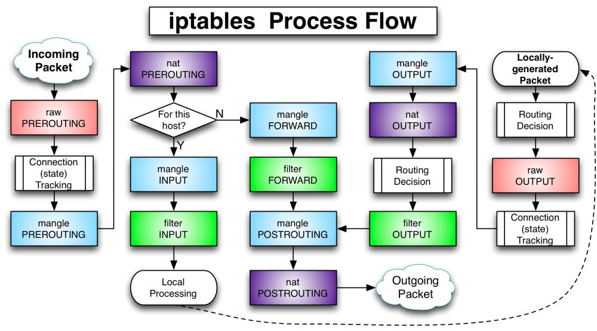

# ĐƯỜNG ĐI CỦA GÓI TIN TRONG IPTABLES

## Tổng quan về đường đi của gói tin trong Netfilter

- Đầu tiên, gói tin được nhận từ card mạng sẽ đi tới Chain PREROUTING. Sau đó, hệ thống sẽ xác định xem gói tin này được định tuyến cho các công việc xử lý nội bộ trong hệ thống hay là gói tin sẽ được chuyển tiếp ra ngoài. 

  - Nếu gói tin được định tuyến cho các tiến trình trong hệ thống (ví dụ như listening socket) thì sẽ được chuyển tới INPUT chain và đi qua các Local Process, xong được định tuyến tới chain OUTPUT. 

  - Còn những gói tin không được định tuyến đi trong hệ thống thì sẽ được chuyển tới FORWARD chain. Lúc này hệ thống sẽ hoạt động như một Router chuyển tiếp gói tin.
  
  - Các gói tin sau khi đi qua OUTPUT chain hoặc FORWARD chain sẽ được chuyển tiếp tới POSTROUTING chain để được đi ra ngoài hệ thống. 

- Đối với các gói tin xuất phát từ chính nội bộ hệ thống (như là các gói tin được tạo bởi tiến trình, phần mềm,...), các gói tin ấy sẽ được định tuyến tới chain OUTPUT, sau đó là POSTROUTING chain và được chuyển tiếp ra ngoài.

## Chi tiết hơn về Packet Flow trong iptables:

- Đường đi của gói tin trong iptables nhìn chung sẽ có tuyến đường như sau:

PREROUTING 

-> INPUT (nếu là gói tin định tuyến nội bộ) -> OUTPUT 
 
-> FORWARD (nếu gói tin được định tuyến ra ngoài)

sau đó cùng đi tới POSTROUTING
           

1. Bắt đầu với gói tin đi từ ngoài vào (incoming packets)
- Gói tin đi từ ngoài vào sẽ được xử lý bởi Chain PREROUTING của bảng Raw table. 

  - Mục đích của bảng Raw là đánh dấu gói tin liệu gói tin đó có nên được xử lý bởi connection tracking system hay không (như việc không giữ lại thông tin về trạng thái gói tin, không áp dụng các quy tắc của stateful firewall lên trên packet,...).

  - Sử dụng NOTRACK target để đánh dấu gói tin

  - Bảng Raw table chỉ bao gồm PREROUTING và OUTGOING chains bởi nó chỉ được sử dụng để track gói tin đi vào hệ thống hoặc được tạo ra trong hệ thống để chuyển đi.

- Tiếp đến là chain PREROUTING của bảng Mangle table. Gói tin đi qua đây sẽ được thay đổi một số thông tin như TOS (Types of Service) trước khi đi qua quyết định dẫn đường.

- Gói tin được chuyển tiếp tới chain PREROUTING của Nat table. Ở đây gói tin được DNAT (Destination NAT)

2. Sau khi đi qua PREROUTING chain:
- Đối với gói tin được xác định đi trong hệ thống: các gói tin này sẽ đi qua INPUT chain
  - Gói tin sẽ đi tới chain INPUT của mangle và filter table. Với INPUT chain của mangle table, gói tin sẽ được thay đổi một vài thông tin. Còn filter table đơn giản là lọc gói tin.

  - Mọi gói tin được định tuyến đi trong host sẽ phải đi qua filter Chain này. Sau đó, gói tin được chuyển tới các local process để được xử lý.
  
  - Sau khi được xử lý xong, gói tin sẽ được chuyển tới chain OUTPUT của Raw table. Mục đích của việc này là thay đổi thông tin gói tin, ví dụ như đánh dấu gói tin không cần được thực hiện connection tracking.

  - Sau khi đi qua connection tracking, gói tin được tiếp tục đi tới chain OUTPUT của mangle và nat và filter table. Ở bảng nat table, gói tin được thực hiện SNAT (Source NAT). 

- Đối với gói tin được xác định đi ra ngoài hệ thống: các gói tin này sẽ đi vào FORWARD chain
  - Ở đây, gói tin sẽ lần lượt được đi qua Mangle table và Filter table, sau đó tiếp tục đi qua Mangle và Filter table của POSTROUTING chain để đi ra ngoài hệ thống. Lúc này, hệ thống của chúng ta sẽ hoạt động như Router.

3. Gói tin xuất phát từ Firewall đi ra:

- Nếu gói tin là xuất phát từ trong hệ thống (Local process), gói tin sẽ đi qua lần lượt các chain Raw, Mangle, Nat và filter tables của OUTPUT chain, sau đó được chuyển tiếp tới Mangle và Filter table của POSTROUTING chain để thực hiện đi ra ngoài hệ thống.

# References
- [Packet Flow, Netfilter and Iptables](https://medium.com/@dipakkrdas/netfilter-and-iptables-f8a946bb83af)

- [iptables Tutorial](https://www.frozentux.net/iptables-tutorial/iptables-tutorial.html#TRAVERSINGOFTABLES)