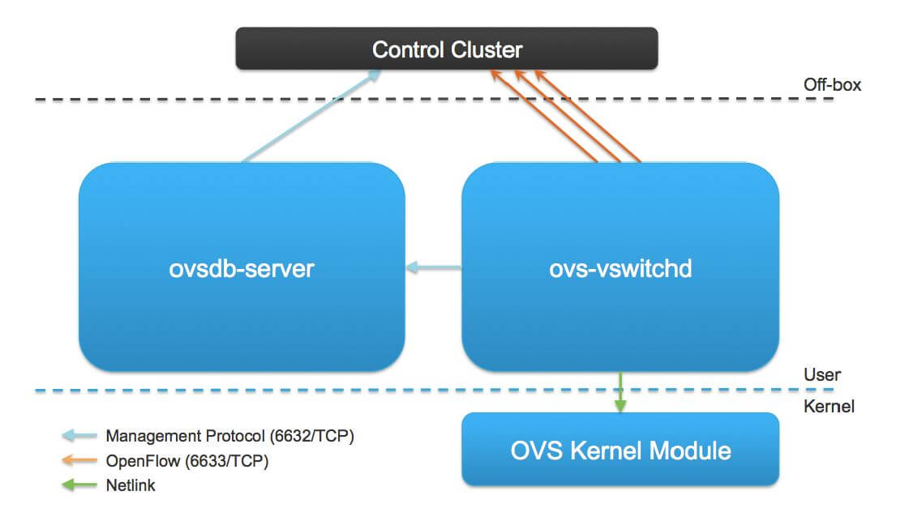
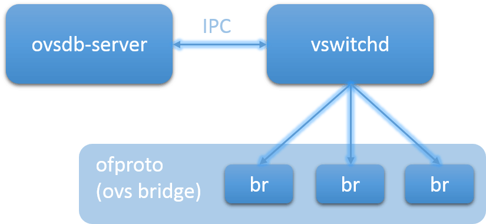
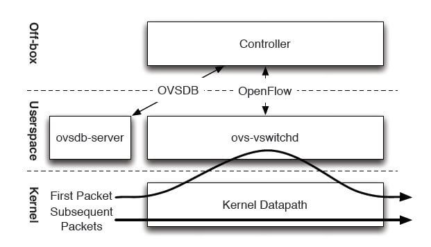

# TỔNG QUAN VỀ OPEN-VSWITCH

Mục lục:
- 1. Tổng quan về Open vSwitch
- 2. 


## Tổng quan về Open vSwitch:

- OVS thường được sử dụng để kết nối các VM/containers trong cùng một host với nhau. Ví dụ như trong OpenStack compute node, OVS được sử dụng như một integration bridge để kết nối tất cả các VMs chạy trong cùng 1 node. 

- OVS quản lý cả physical (như eth0, eth1) và virtual ports (tap devices).

### Kiến trúc của OVS:

- Kiến trúc chung của OVS sẽ trông giống như sau:




- Có 3 thành phần cấu thành nên OVS mà ta cần phải biết đó là:

  - vswitchd (virtual switch daemon): là chương trình user-space, hay thường được gọi là ovs daemon. 
  - Công cụ để ta tương tác với vswitchd là ```ovs-appctl```.

  - ovsdb-server (openvswitch database server): cũng là chương trình user-space, và là database server của OVS. 
  - Công cụ tương tác: ```ovs-vsctl```, ```ovs-oftcl```.

  - kernel module (hay còn là datapath): là module nằm trong kernel space, là nơi chịu trách nhiệm forward gói tin trong OVS. 
  - Công cụ tương tác: ```ovs-dpctl```.


- Nói tóm lại, ```vswitchd``` là tiến trình daemon chính của OVS, ```ovsdb-server``` là database server của OVS, còn ```datapath``` là kernel module thực hiện việc forward gói tin dựa trên vào platform (platform-dependent)


### Các thành phần trong OVS:

#### 1. OVS Daemon:

- ```ovs-vswitchd``` là chương trình chính của OVS chạy trên userspace. 
  - Nhiệm vụ: đọc cấu hình mà ta muốn thiết lập cho OVS từ ```ovsdb-server``` thông qua kênh giao tiếp IPC (Inter Process Communication) và truyền các thông số này xuống ovs bridges (ovs bridge lúc này được triển khai như một thư viện có tên là ```ofproto```). Ngoài ra, ```ovs-vswitchd``` còn thực hiện cập nhật trạng thái và thông tin của ovs bridge cho database.



#### 2. OVSDB:

- Là nơi lưu các cấu hình có tính persistent, nghĩa là các cấu hình này vẫn còn được giữ kể cả khi hệ thống reboot. Còn các cấu hình mang tính chất tạm thời (sẽ biến mất sau khi reboot,...) thì được lưu ở ```datapaths``` và ```vswitchd```.

- ```ovsdb-server``` provides RPC itnerfaces to OVSDB. It supports JSON-RPC client connections over active or passive TCP/IP or Unix domain sockets.

- ```ovsdb-server``` có thể hoạt động như backup server, hoặc đóng vai trò như một active server. Chỉ có active server mới có thể xử lý các thay đổi cấu hình ở OVSDB


#### 3. Datapath:

- Datapath là module chuyển gói tin chính của OVS, được triển khai ở kernel space (với mục đích là tăng hiệu suất).

- Datapath có nhiệm vụ caches lại các OpenFlow flows, và thực hiện các hành động trên các gói tin nếu gói tin đó match một hoặc các flow nào đó. 

- Nếu không có flow nào match, gói tin sẽ được chuyển tiếp tới userspace program là ```ovs-vswitchd```. 

- Thông thường, ```ovs-vswitchd``` sẽ xử lý gói tin này, và tạo ra một flow tương ứng gửi đến ```datapath``` để nếu sau này có gói tin tương tự thì sẽ được xử lý theo flow đã được tạo ở trên. 

- Sự thật là hiệu suất của packet forwarding của OVS cao đó là vì hầu hết các gói tin đều sẽ match thành công 1 hoặc nhiều flows ở datapath. Và một khi được match ở datapath rồi thì gói tin sẽ được xử lý trực tiếp ở kernel space - nơi xử lý gói tin nhanh hơn rất nhiều so với user space.


#### 4. Xử lý gói tin trong OVS:

- OVS không chỉ là một soft switch thông thường. Nó còn hỗ trợ việc xử lý các gói tin dựa trên OpenFlow.

> ```OpenFlow controller``` có nhiệm vụ điều hướng ```Datapath``` cách xử lý các loại gói tin khác nhau (hay chính là ```flows```)

> ```Flow``` là cách định nghĩa hành động mà ```Datapath``` nên thực hiện khi gặp gói tin thỏa mãn các tiêu chí nào đó (ví dụ như src ip, dest ip, protocol,...). Hành động thực hiện đó được gọi là ```actions```.

> ```Actions``` có thể kể đến như là forward gói tin tới port khác, thay đổi VLAN tag,...

> Việc tìm kiếm flow cho một packet được gọi là ```flow matching```

- Để đáp ứng nhu cầu về mặt hiệu năng, một phần flows được cache lại trong datapath, còn phần còn lại được lưu ở ```vswitchd```.

- Dưới đây là hình minh họa luồng đi của packet trong OVS



  - Đầu tiên, gói tin sẽ được chuyển tiếp tới Datapath sau khi được nhận trên card mạng (NIC - Network Interface Card). 
  
  - Nếu một flow nào đó match với packet trong datapath, datapath chỉ việc thực hiện actions được định nghĩa trong flow đó

  - Trong trường hợp không có flow match, datapath sẽ chuyển tiếp gói tin tới userspace program đã được đề cập ở trên là ```ovs-vswitchd```. Ở đây, hành động flow-matching sẽ được thực thi. 

  - Sau khi ```ovs-vswitchd``` quyết định được cách gói tin nên được xử lý như thế nào, nó sẽ chuyển gói tin quay trở lại datapath với cách xử lý đã được định nghĩa trước đó.

  - Thông thường, ```ovs-vswitchd``` cũng chỉ định datapath thực hiện hành động cache lại flow đó, để nếu sau này có các gói tin tương tự thì chỉ việc xử lý gói tin theo flow được cache.

### Tóm tắt lại:

1. Có 3 thành phần chính của OVS

- vswitchd, ovsdb, datapath (kernel module)

2. Các cách triển khai

- ovs-vswitchd: là thành phần chính của OVS daemon

- ovsdb-server: là OVSDB service daemon
