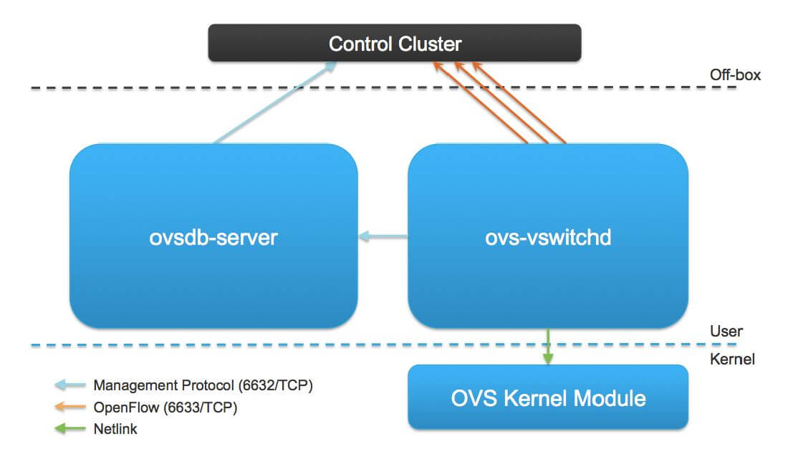

# TỔNG QUAN VỀ OPEN-VSWITCH: VSWITCHD

## 1. Tổng quan về vswitchd:



- Ta có thể thấy rằng ```ovs-vswitchd``` là thành phần chính của OVS, tương tác với các OpenFlow controller, OVSDB và kernel module.

- Các thành phần chính: 
  - giao tiếp với bên ngoài sử dụng OpenFlow

  - giao tiếp với ovsdb-server sử dụng OVSDB protocol

  - giao tiếp với kernel thông qua netlink

  - giao tiếp với hệ thống thông qua netdev abstract interface

- Công cụ tương tác: ```ovs-ofctl```, ```ovs-appctl```


```
+-------------------+
|    ovs-vswitchd   |<-->ovsdb-server
+-------------------+
|      ofproto      |<-->OpenFlow controllers
+--------+-+--------+
| netdev | | ofproto|
+--------+ |provider|
| netdev | +--------+
|provider|
+--------+
```

- Theo cấu trúc ở trên, ta có thể phân tách vswith module ra các submodules/libraries như sau:

  - ```ovs-vswitchd```: là vswitchd daemon

  - ```ofproto```: là thư viện thực hiện việc ảo hóa (abstract) ovs bridge

  - ```ofproto-provider```: là interface để kiểm soát OpenFlow switch

  - ```netdev```: là thư viện ảo hóa (abstract) network device (tun/tap interface,...)

  - ```net-dev-provider```: OS và các hardware-specific interface tới network devices(?)
> (OS- and hardware-specific interface to network devices)

## 2. Chi tiết hơn về vswitchd:

```
            _
            |   +-------------------+
            |   |    ovs-vswitchd   |<-->ovsdb-server
            |   +-------------------+
            |   |      ofproto      |<-->OpenFlow controllers
            |   +--------+-+--------+  _
            |   | netdev | |ofproto-|   |
userspace |   +--------+ |  dpif  |   |
            |   | netdev | +--------+   |
            |   |provider| |  dpif  |   |
            |   +---||---+ +--------+   |
            |       ||     |  dpif  |   | implementation of
            |       ||     |provider|   | ofproto provider
            |_      ||     +---||---+   |
                    ||         ||       |
            _  +---||-----+---||---+   |
            |   |          |datapath|   |
    kernel |   |          +--------+  _|
            |   |                   |
            |_  +--------||---------+
                        ||
                    physical
                        NIC
```

- OVS bridge kiểm soát 2 loại tài nguyên, bao gồm forwarding plane (là datapath) và physical + virtual network device gắn với nó (netdev).

- Cấu trúc chính:
  - Triển khai OVS bridge: các submodules ofproto, ofproto-provider sẽ làm việc này

  - Kiểm soát datapath: sử dụng các submodules dpif, dpif-provider

  - Kiểm soát các network devices: netdev, netdev-provider

  

