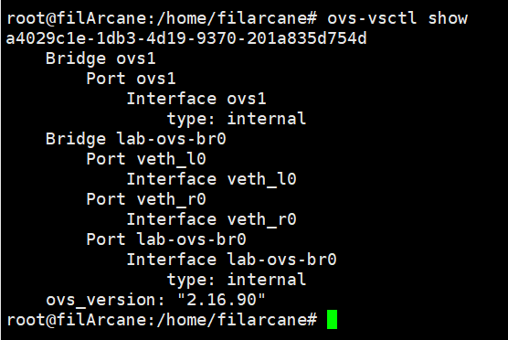

# LAB với tính năng Open vSwitch conntrack

## Mô hình bài Lab:

```
    +                                                       +
    |                                                       |
    |                       +-----+                         |
    |                       |     |                         |
    |                       |     |                         |
    |     +----------+      | OVS |     +----------+        |
    |     |   VM1    |      |     |     |   VM2    |        |
    |     |10.10.0.10|      |     |     |10.20.0.21|        |
    +-----+        A +------+     +-----+ B        +--------+
    |     |          |    A'|     | B'  |          |        |
    |     |          |      |     |     |          |        |
    |     +----------+      |     |     +----------+        |
    |                       |     |                         |
    |                       |     |                         |
    |                       |     |                         |
    |                       +-----+                         |
    |                                                       |
    |                                                       |
    +                                                       +
10.10.0.X network                                          10.20.0.X network

A  = veth_l1
A' = veth_l0
B  = veth_r1
B' = veth_r0

```

- Mô hình: tạo 2 network namespace với network 10.10.0.X và 10.20.0.X. Đứng từ OVS, gói tin đi từ namespace này sang namespace khác sẽ giống việc gói tin đi từ các host với network khác nhau.

## Thực hành:

- Tạo các network namespace tương ứng:

```ip netns add left``` và ```ip netns add right```

- Tạo các veth gắn vào left namespace và OVS:

```ip link add veth_l0 type veth peer name veth_l1```

Tương ứng với right namespace:

```ip link add veth_r type veth peer name veth_r1```

- Gắn lần lượt veth_l1 và veth_r1 vào network namespace tương ứng:

```ip link set veth_l1 netns left``` 

Tương ứng với right namespace:

```ip link set veth_r1 netns right```

- Tạo OVS bridge:

```ovs-vsctl add-br lab-ovs-br0```

- Gắn các cổng veth_l0 và veth_r0 vào OVS bridge vừa tạo:

```ovs-vsctl add-port lab-ovs-br0 veth_l0```

Tương ứng với bên còn lại:

```ovs-vsctl add-port lab-ovs-br0 veth_r0```

Khi show bridge ta sẽ được kết quả như sau (phần lab-ovs-br0)




